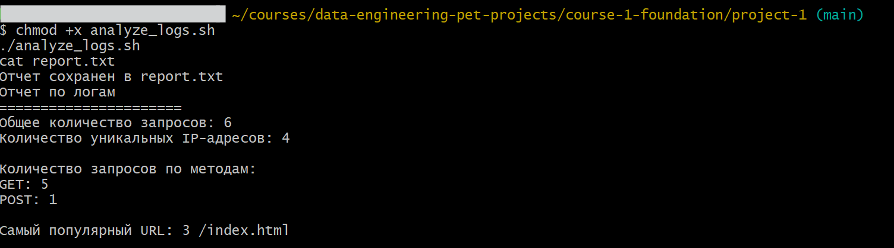

# Log Analysis with Bash

This project analyzes web server logs using only Bash and Linux tools.

The script `analyze_logs.sh` processes `access.log` and generates a report (`report.txt`) with:

- Total number of requests
- Number of unique IP addresses (using `awk`)
- Number of requests by HTTP methods (GET, POST, etc.) using `awk`
- Most popular URL with request count (using `awk`)

## Project Files

```
analyze_logs.sh
access.log
report.txt
README.md
screenshot.png
```

## Run

Make the script executable:

```bash
chmod +x analyze_logs.sh
```

Run the script:

```bash
./analyze_logs.sh
```

Display the generated report:

```bash
cat report.txt
```

## Expected Output

The script creates `report.txt` containing log analysis results.

Example:

```text
Report
======================
Total requests: 6
Unique IP addresses: 4

Requests by method:
GET: 5
POST: 1

Most popular URL:
3 /index.html
```

## Screenshot

